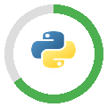
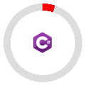

# Geek Man's Github

### A young French developer with a passion for computer science who is constantly learning through personal projects and school.

## Languages:
###### *self notation*

<!--##### Python: 
##### HTML / CSS
##### JavaScript
##### C#
-->

<!--
**GeekMan44/GeekMan44** is a ✨ _special_ ✨ repository because its `README.md` (this file) appears on your GitHub profile.

Here are some ideas to get you started:

- 🔭 I’m currently working on ...
- 🌱 I’m currently learning ...
- 👯 I’m looking to collaborate on ...
- 🤔 I’m looking for help with ...
- 💬 Ask me about ...
- 📫 How to reach me: ...
- 😄 Pronouns: ...
- ⚡ Fun fact: ...
-->
